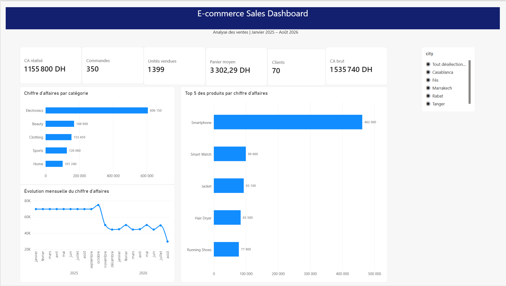

# E-commerce Sales Dashboard with Power BI

Interactive Power BI dashboard built from PostgreSQL e-commerce sales data.

## Project Overview

This project analyzes e-commerce sales performance from January 2025 to August 2026. The dashboard provides an overview of revenue, completed orders, customers, units sold, product performance, category performance and monthly sales trends.

## Tools Used

- PostgreSQL
- Power Query
- Power BI
- DAX
- Git and GitHub

## Data Model

The report uses a relational model composed of five tables:

- `customers`
- `orders`
- `order_items`
- `products`
- `categories`

Main relationships:

- Customers → Orders
- Orders → Order Items
- Products → Order Items
- Categories → Products

## Key Metrics

- Gross revenue: 1,535,740 DH
- Completed revenue: 1,155,800 DH
- Completed orders: 350
- Purchasing customers: 70
- Units sold: 1,399
- Average order value: 3,302.29 DH

## DAX Measures

```DAX
Total Revenue =
SUMX(
    order_items,
    order_items[quantity] * order_items[unit_price]
)
```

```DAX
Completed Revenue =
CALCULATE(
    [Total Revenue],
    orders[status] = "completed"
)
```

```DAX
Completed Orders =
CALCULATE(
    DISTINCTCOUNT(orders[order_id]),
    orders[status] = "completed"
)
```

```DAX
Purchasing Customers =
CALCULATE(
    DISTINCTCOUNT(orders[customer_id]),
    orders[status] = "completed"
)
```

```DAX
Units Sold =
CALCULATE(
    SUM(order_items[quantity]),
    orders[status] = "completed"
)
```

```DAX
Average Order Value =
DIVIDE(
    [Completed Revenue],
    [Completed Orders],
    0
)
```

## Dashboard Features

- Revenue by product category
- Monthly completed-revenue trend
- Top five products by completed revenue
- Interactive city filter
- Dynamic KPI cards

## Key Insights

- Electronics generates the largest share of completed revenue.
- Smartphone is the highest-performing product.
- Monthly completed revenue declined significantly after October 2025.
- The city slicer enables geographical performance comparisons.

## Dashboard Preview

